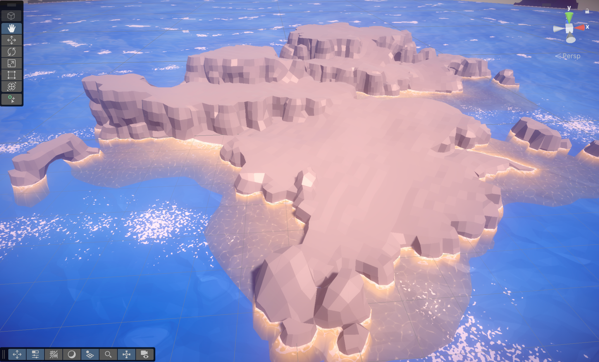
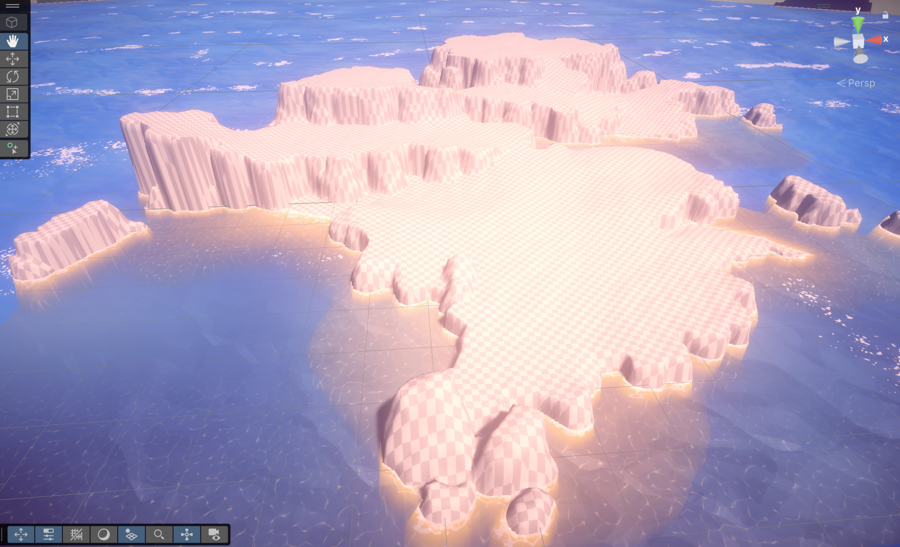
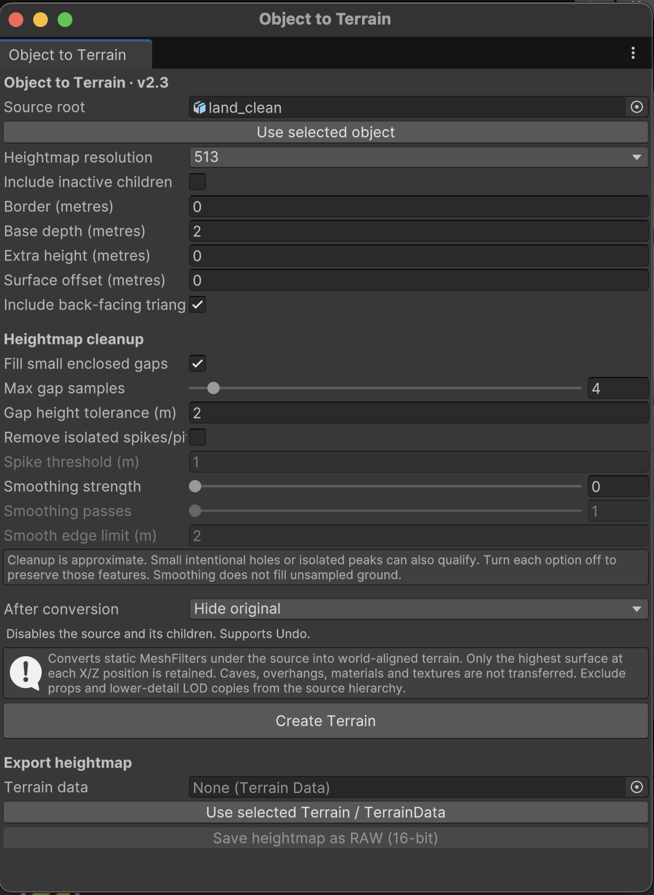

# Object2Terrain for Unity 6

Convert a 3D mesh into an editable Unity Terrain, with optional heightmap cleanup and 16-bit RAW export.

**Version 2.3** · Updated by [LabGlitch](https://labglitch.com/) · Original script by **Eric Haines (Eric5h5)**

Developed while building a pirate island game, this update brings the original Object2Terrain workflow to Unity 6 and adds saved TerrainData assets, child mesh support, cleanup controls and source object handling.

## Before and after

| Original mesh | Converted Unity Terrain |
| :---: | :---: |
|  |  |

The screenshots show the same island before and after conversion. The checkerboard is the terrain's displayed surface, not a texture copied from the mesh. The ocean is part of the example scene and is not generated by this tool.

Terrain captures the upper surface: notice that the open arch on the left becomes solid ground beneath its top. Caves and overhangs need separate meshes.

## Features

* Convert static meshes and their child meshes into a world-aligned Unity Terrain.
* Account for source position, rotation and scale.
* Choose heightmap resolutions from **33 to 4097**.
* Save TerrainData automatically in `Assets/GeneratedTerrains`.
* Repair small enclosed gaps caused by missed raycast samples.
* Optionally remove isolated spikes and pits.
* Apply adjustable smoothing, with an edge limit to reduce blending across large height changes.
* Keep, hide or delete the original scene object after conversion, with Undo support.
* Export the resulting heightmap as **16-bit little-endian RAW**.
* Show progress and allow cancellation during sampling and cleanup.

## Installation

1. Download `Object2Terrain.cs` from this repository.
2. Place it in your Unity project at `Assets/Editor/Object2Terrain.cs`. Create the `Editor` folder if needed.
3. If you have an older copy, replace it rather than keeping both scripts.
4. Let Unity finish compiling.

This is an **Editor tool for Unity 6**. Run it in Edit Mode. The source must contain readable triangle meshes on `MeshFilter` components; skinned meshes are not supported.

## Quick start

1. Select your imported model in the Project window, enable **Read/Write** in its import settings and click **Apply**.
2. Place the mesh in a normal scene and select its root object in the Hierarchy.
3. Open **Terrain → Object to Terrain**.
4. Check the **Source root** field. Use **Use selected object** to change it.
5. Start at **513** resolution. Keep smoothing at **0** for an initial comparison.
6. Choose what should happen to the original object under **After conversion**.
7. Click **Create Terrain**.

The new Terrain is selected automatically. Its TerrainData is saved as a uniquely named asset in `Assets/GeneratedTerrains`. Save your scene to retain the new scene object.

### Editor window

## Conversion settings

| Setting | Default | What it does |
| --- | --- | --- |
| Heightmap resolution | 513 | Controls sample density. Higher values can capture more detail but take longer. |
| Include inactive children | Off | Includes inactive child mesh objects beneath the source. |
| Border | 0 m | Adds space around each side of the mesh's X/Z bounds. |
| Base depth | 2 m | Places the terrain base below the lowest source vertex. Unsampled areas remain at that base. |
| Extra height | 0 m | Adds vertical range above the source. |
| Surface offset | 0 m | Shifts sampled heights within the terrain's vertical range. Out-of-range values are clamped. |
| Include back-facing triangles | On | Allows sampling of reversed or thin surfaces. |
| After conversion | Hide original | Keeps, disables or removes the source hierarchy after a successful conversion. |

**Hide original** disables the source object and its children, including their colliders. **Delete original** removes that hierarchy from the scene; it does not delete the imported mesh asset. An inherited prefab child that cannot be deleted independently is kept, with a Console message.

Undo restores source changes and removes the generated scene Terrain. The saved TerrainData asset remains in the Project window.

## Heightmap cleanup

Cleanup runs before the TerrainData is saved. Change the settings and convert again to produce a new result; these controls do not modify an existing Terrain in place.

| Setting | Default | Behaviour |
| --- | --- | --- |
| Fill small enclosed gaps | On | Fills small connected groups of missed samples, excluding regions connected to the heightmap boundary. |
| Max gap samples | 4 | Largest missed-sample region eligible for repair, measured in samples rather than metres. |
| Gap height tolerance | 2 m | Skips gaps whose surrounding heights vary by more than this amount. |
| Remove isolated spikes/pits | Off | Replaces a single outlying sample when all eight neighbours form a nearly level surface. |
| Spike threshold | 1 m | Minimum height difference beyond all surrounding samples for spike/pit removal. |
| Smoothing strength | 0 | Blends valid samples towards nearby heights. Zero disables smoothing. |
| Smoothing passes | 1 | Number of smoothing passes, from 1 to 10. |
| Smooth edge limit | 2 m | Excludes neighbours with larger height differences from the smoothing average. |

Start with low smoothing strength and one pass. Smoothing leaves unsampled areas and samples immediately beside them unchanged. Cleanup is approximate: small intentional holes or isolated peaks can qualify, so disable the relevant option when preserving them matters.

## Export a RAW heightmap

After conversion, the **Terrain data** export field is filled automatically. You can also assign another TerrainData asset, or select a Terrain and click **Use selected Terrain / TerrainData**.

Click **Save heightmap as RAW (16-bit)** and choose a destination. The tool displays the matching import settings and offers to copy them.

To import the exported file through Unity's Terrain Settings → **Import Raw**:

| Import setting | Value |
| --- | --- |
| Depth | Bit 16 |
| Width and Height | Match the exported heightmap resolution |
| Byte Order | Windows / Little Endian, including on Mac |
| Flip Vertically | Off |
| Terrain size X / Y / Z | Match the values shown by the exporter |

RAW contains height samples only. It does not store terrain dimensions, world position, textures, terrain holes or scene objects. Keep the displayed dimensions with your export, and position the imported Terrain as needed.

## Limitations and tips

* The tool samples the **highest surface at each X/Z position**. It cannot preserve caves, overhangs, arches or multiple stacked surfaces.
* Materials, textures, UVs, trees and props are not transferred.
* The generated Terrain aligns with the world axes, even when the source mesh is rotated.
* Keep props and alternate LOD meshes outside the source hierarchy; otherwise their geometry may be sampled too.
* Higher resolution improves sampling density but cannot remove the limitations of a heightmap. Near-vertical cliffs and narrow details may need adjustment or separate meshes.
* Mesh conversion has been used successfully in the maintainer's Unity 6 project. Compatibility with every Unity 6 release and mesh type is not guaranteed.

## Credits and licence

Original **Object2Terrain** script by **Eric Haines (Eric5h5)**.

Unity 6 updates and additional features by **[LabGlitch](https://labglitch.com/)**, September 2026. Changes include child mesh conversion, transform and edge-sampling fixes, saved TerrainData, cancellation and cleanup, source handling with Undo, gap repair, spike/pit removal, optional smoothing and RAW export.

Source references:

* [Archived original Unity wiki page](https://web.archive.org/web/20210802120139/https://wiki.unity3d.com/index.php?title=Object2Terrain)
* [Original script download](https://www.mediafire.com/file/3oyvdjcjix2d3iu/Object2Terrain.cs)
* [LMHPOLY's mesh-to-terrain tutorial](https://www.lmhpoly.com/tutorials/convert-mesh-to-unity-terrain)

This adapted script is shared under **[Creative Commons Attribution-ShareAlike 3.0 Unported (CC BY-SA 3.0)](https://creativecommons.org/licenses/by-sa/3.0/)**, following the licence notice on the archived source page.

Retain attribution, link to the licence, identify further changes and follow its ShareAlike terms when distributing adaptations. No endorsement by the original author is implied. See the [full licence text](https://creativecommons.org/licenses/by-sa/3.0/legalcode).

## Feedback

Bug reports and suggestions are welcome through this repository's Issues tab. Please include your Unity version, conversion settings, relevant Console errors and a screenshot or small reproduction mesh where possible.
